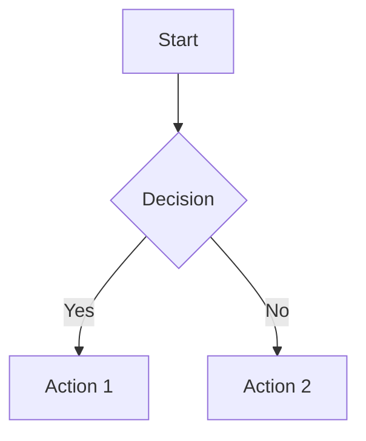
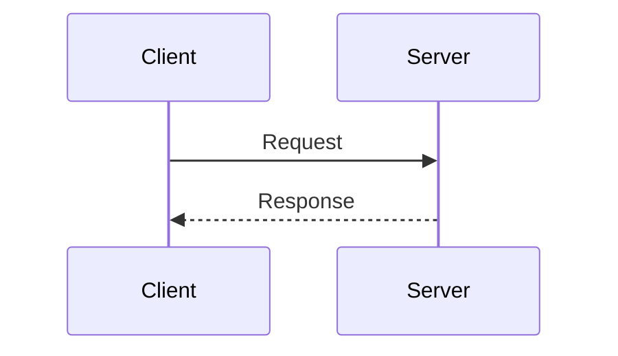
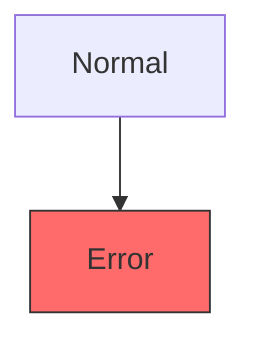
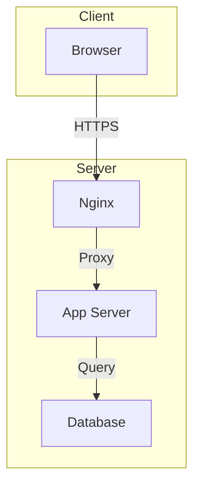
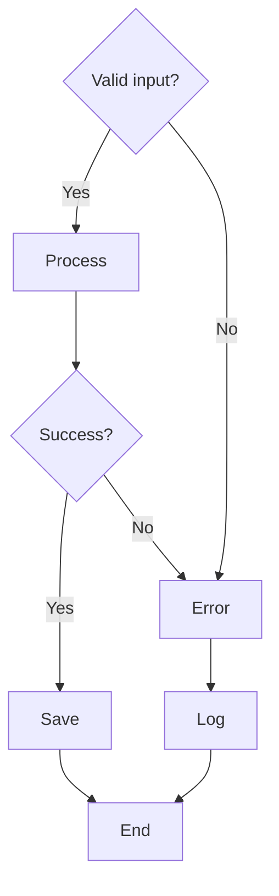
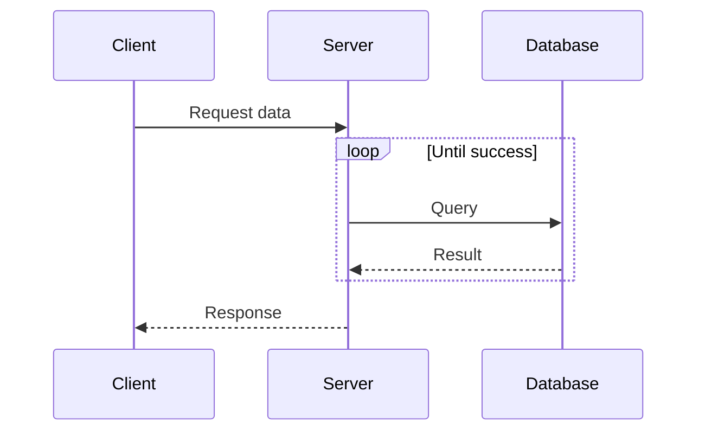

# Mermaid Diagrams Skill

Guidelines for creating valid Mermaid diagrams in MkDocs documentation.

## Overview

This skill provides standards for creating flowcharts, sequence diagrams, and other visualizations using Mermaid syntax that renders correctly in MkDocs with the mermaid2 plugin.

## Theme-Specific Issues

### mkdocs-terminal Theme

The **terminal** theme has known issues with Mermaid:

1. **Subgraph quotes cause syntax errors** - Use unquoted subgraph names
2. **HTML tags (`<br/>`) cause parsing errors** - Use `\n` or avoid line breaks in labels
3. **Code blocks may lose whitespace** - Ensure proper blank lines around code blocks

**Workaround for terminal theme:**
```yaml
# mkdocs.yml - ensure proper extension order
markdown_extensions:
  - pymdownx.superfences:
      custom_fences:
        - name: mermaid
          class: mermaid
          format: !!python/name:mermaid2.fence_mermaid_custom
```

## Basic Syntax

### Flowchart (Graph)



**Valid directions:**
- `TD` or `TB` - Top Down/Top Bottom
- `BT` - Bottom Top
- `LR` - Left Right
- `RL` - Right Left

### Sequence Diagram



## Node Types

| Syntax | Type | Example |
|--------|------|---------|
| `[Text]` | Rectangle | `A[Process]` |
| `(Text)` | Rounded | `B(Start)` |
| `{Text}` | Diamond/Decision | `C{Valid?}` |
| `((Text))` | Circle | `D((End))` |
| `>Text]` | Flag | `E>Input]` |
| `[/Text/]` | Parallelogram | `F[/Data/]` |

## Connections

| Syntax | Meaning |
|--------|---------|
| `-->` | Solid arrow |
| `---` | Solid line |
| `-.->` | Dotted arrow |
| `==>` | Thick arrow |
| `-->|Label|` | Arrow with label |

## Styling

Use `style` commands, not inline colors:



**Valid CSS properties:**
- `fill` - Background color (hex only, no names)
- `stroke` - Border color
- `stroke-width` - Border width
- `color` - Text color

## Common Syntax Errors to Avoid

### 1. Invalid Characters in Labels

```markdown
<!-- WRONG -->
A[Text with "quotes"] --> B

<!-- CORRECT -->
A[Text with quotes] --> B
```

### 2. Missing Node Definitions

```markdown
<!-- WRONG -->
A --> B
C --> D  <- C and D never defined

<!-- CORRECT -->
A[Start] --> B[End]
C[Input] --> D[Output]
```

### 3. Invalid Direction Specifiers

```markdown
<!-- WRONG -->
flowchart DOWN

<!-- CORRECT -->
flowchart TD
```

### 4. Special Characters in Node IDs

```markdown
<!-- WRONG -->
node-1[Text] --> node_2[Text]

<!-- CORRECT -->
node1[Text] --> node2[Text]
```

### 5. Empty Labels

```markdown
<!-- WRONG -->
A[] --> B

<!-- CORRECT -->
A[Text] --> B[Text]
```

## Testing Diagrams

Always test with MkDocs build:

```bash
mkdocs build 2>&1 | grep -i mermaid
```

Successful output:
```
INFO    -  MERMAID2  - Page 'page-name': found N diagrams, adding scripts
```

## MkDocs Configuration

Required in `mkdocs.yml`:

```yaml
plugins:
  - mermaid2

markdown_extensions:
  - pymdownx.superfences:
      custom_fences:
        - name: mermaid
          class: mermaid
          format: !!python/name:mermaid2.fence_mermaid_custom
```

## Examples

### System Architecture



### Decision Tree



### Sequence with Loops



## References

- [Mermaid Documentation](https://mermaid.js.org/intro/)
- [MkDocs Mermaid2 Plugin](https://mkdocs-mermaid2.readthedocs.io/)
- [Flowchart Syntax](https://mermaid.js.org/syntax/flowchart.html)
- [Sequence Diagram Syntax](https://mermaid.js.org/syntax/sequenceDiagram.html)
