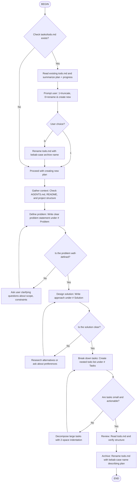

# Plan Building Flow

This flow guides through creating a structured plan document at `tasks/todo.md`.



## Handling Existing todo.md

Before creating a new plan:

1. **Check for existing file**: Look for `tasks/todo.md`
2. **If exists**: Read and summarize:
   - The problem statement (brief)
   - Overall progress (% complete or tasks done/total)
3. **Prompt user**:
   ```
   Existing plan found: [brief description]
   Progress: [X% complete or X/Y tasks done]
   
   Choose action:
   1 - Truncate (overwrite with new plan)
   0 - Archive current and create new
   ```
4. **If user chooses 0** (rename): Generate kebab-case archive name (max 5 words) describing the plan, e.g., `refactor-auth-module.md`, `implement-user-dashboard.md`, `fix-memory-leak-issue.md`

## Output Format

The flow creates `tasks/todo.md` with this structure:

```markdown
# Problem

Clear statement of what needs to be solved.

# Solution

High-level approach to solving the problem.

# Tasks

## [Category/Phase]
- [ ] Task 1
  - [ ] Subtask 1.1
  - [ ] Subtask 1.2
- [ ] Task 2
```

## Task Nesting Rules

- Use `- [ ]` for all task items
- Indent subtasks with 2 spaces: `  - [ ] Subtask`
- Group under phase headers: `## Phase Name`
- Keep nesting to 2-3 levels maximum

## Archiving Completed Plans

At the end of the flow, archive the todo.md:

1. Generate a concise kebab-case name (max 5 words) based on the problem/solution
2. Rename `tasks/todo.md` to `tasks/{kebab-name}.md`
3. Examples:
   - Plan: "Implement user authentication with JWT tokens" → `implement-user-auth-jwt.md`
   - Plan: "Fix critical memory leak in data processing pipeline" → `fix-memory-leak-pipeline.md`
   - Plan: "Refactor database connection handling for better performance" → `refactor-db-connection-performance.md`
