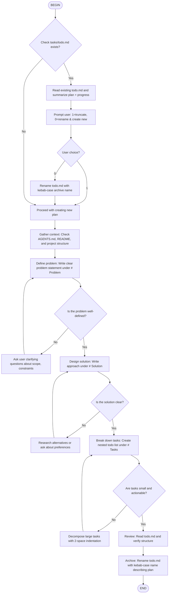

# Plan Building Flow

This flow guides through creating a structured plan document at `tasks/todo.md`.



## Core Principle: Determined Plans

A plan must be **determined** - meaning all research, discovery, and decision-making happens DURING plan building, not during execution. The final plan should contain zero ambiguity.

### What "Determined" Means

**During Plan Building (NOW):**
- Search the codebase to find all affected files
- Identify all functions, types, and variables that need changes
- Make all architectural decisions
- Resolve all "we could do X or Y" choices
- Discover all call sites and dependencies

### Research Tools for Plan Building

When a task implies wide changes or requires project-wide verification, use search tools to discover all affected locations **during plan building**:

**Use Grep for pattern discovery:**
```bash
# Find all occurrences of a pattern across the project
grep -rn "pattern" /path/to/project --include="*.go"

# Example: Find all functions accepting *slog.Logger
grep -rn "logger \*slog\.Logger" /home/user/code/aishift/maestro --include="*.go"
```

**Use Glob to list files in a directory:**
```bash
# List all Go files in a package
glob "core/services/songwriter/*.go"
```

**Use ReadFile to examine specific files:**
- Read files that match patterns to understand context
- Check function signatures and call sites
- Verify line numbers for tasks

**Research must happen BEFORE writing tasks.**

Do NOT write tasks like:
- ❌ "Search for all usages of X"
- ❌ "Find all files that need updating"
- ❌ "Check if there are other occurrences"

DO the search, THEN write determined tasks:
- ✅ "Update X in `file1.go:45`, `file2.go:78` (found 2 occurrences)"
- ✅ "Remove logger param from 9 functions in `prolongator.go:146,168,196,...`"
- ✅ "Add import to 3 files: `file1.go`, `file2.go`, `file3.go`"

**In The Final Plan (RESULT):**
- Each task references specific files, functions, line numbers
- No tasks like "search for...", "find all...", "investigate..."
- No "update project-wide" - instead list every file to update
- No "decide between X and Y" - the decision is made and documented
- Each task is immediately executable without further research

### Examples of Non-Determined vs Determined Tasks

| Non-Determined (BAD) | Determined (GOOD) |
|---------------------|-------------------|
| Search for all usages of `oldFunc` | Update `oldFunc` calls in `file1.go:45`, `file2.go:78`, `file3.go:12` |
| Refactor logger usage project-wide | Replace `*slog.Logger` param with `tracer.Logger(ctx)` in 5 functions across `core/services/songwriter/*.go` |
| Decide between approach A or B | Use approach A: inline function into caller at `file.go:123` |
| Update all related tests | Update `TestFoo` in `foo_test.go`, `TestBar` in `bar_test.go` |
| Fix any broken references | Import `"aishift.co/muso/pkg/errors"` in `file1.go`, `file2.go`; update error return at line 89 from `return err` to `return errors.Wrap(err, "context")` |

## Handling Existing todo.md

Before creating a new plan:

1. **Check for existing file**: Look for `tasks/todo.md`
2. **If exists**: Read and summarize:
   - The problem statement (brief)
   - Overall progress (% complete or tasks done/total)
3. **Prompt user**:
   ```
   Existing plan found: [brief description]
   Progress: [X% complete or X/Y tasks done]
   
   Choose action:
   1 - Truncate (overwrite with new plan)
   0 - Archive current and create new
   ```
4. **If user chooses 0** (rename): Generate kebab-case archive name (max 5 words) describing the plan, e.g., `refactor-auth-module.md`, `implement-user-dashboard.md`, `fix-memory-leak-issue.md`

## Solution Section Requirements

The `# Solution` section must be **prescriptive**, not descriptive:

- State exactly WHAT will be done
- State exactly HOW it will be done  
- NO "we could..." or "one approach is..." or "it might be better to..."
- If alternatives exist, pick one and document the choice
- Include specific file paths, function names, and type signatures

Example:
```markdown
# Solution

Replace all `*slog.Logger` parameters with context-based logger retrieval using `tracer.Logger(ctx)`.

Changes:
1. `core/services/songwriter/generator.go:callGenerator` - remove logger param, use tracer at lines 193, 201, 203
2. `core/services/songwriter/generator.go:persistVariant` - remove logger param, use tracer at lines 227, 229, 241
3. `core/services/songwriter/other.go:someFunc` - [same pattern]
```

## Output Format

The flow creates `tasks/todo.md` with this structure:

```markdown
# Problem

Clear statement of what needs to be solved.

# Solution

High-level approach to solving the problem.

# Tasks

## [Category/Phase]
- [ ] Task 1
  - [ ] Subtask 1.1
  - [ ] Subtask 1.2
- [ ] Task 2
```

## Task Nesting Rules

- Use `- [ ]` for all task items
- Indent subtasks with 2 spaces: `  - [ ] Subtask`
- Group under phase headers: `## Phase Name`
- Keep nesting to 2-3 levels maximum
- **Every task must be executable without additional research**

## Archiving Completed Plans

At the end of the flow, archive the todo.md:

1. Generate a concise kebab-case name (max 5 words) based on the problem/solution
2. Rename `tasks/todo.md` to `tasks/{kebab-name}.md`
3. Examples:
   - Plan: "Implement user authentication with JWT tokens" → `implement-user-auth-jwt.md`
   - Plan: "Fix critical memory leak in data processing pipeline" → `fix-memory-leak-pipeline.md`
   - Plan: "Refactor database connection handling for better performance" → `refactor-db-connection-performance.md`
